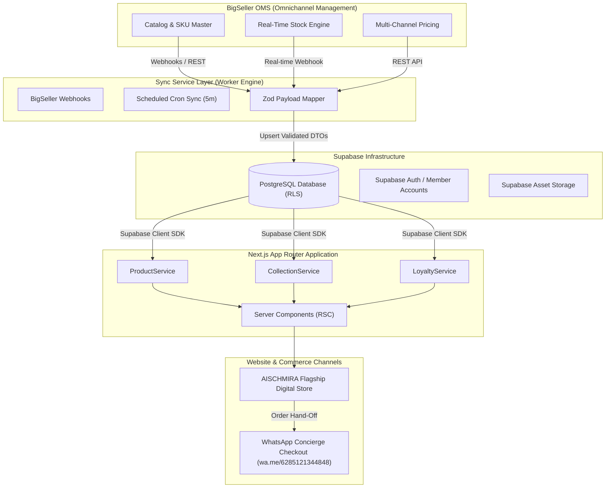

# AISCHMIRA.STORE — Enterprise Integration Architecture & API Strategy

**Version:** 1.0.0  
**Source of Truth:** `docs/13_API_PLAN.md`, `services/domain/`  

---

## 1. System Topology & Data Flow

The AISCHMIRA.STORE integration architecture operates on a decoupled multi-tier topology that connects **BigSeller Omnichannel OMS**, **Supabase Cloud Infrastructure**, **Next.js App Router Service Layer**, and the **WhatsApp Concierge Commerce Channel**.

---

## 2. Layer Responsibilities & Architecture

### 2.1 BigSeller Omnichannel Management System (OMS)
- **Master Data Source**: Primary authority for master catalog creation, SKU variants (`parentSku`, `sku`), physical warehouse stock levels, and order fulfillment states.
- **Outbound Integration**: Emits HTTP webhooks on stock changes (`stock.update`) and price updates (`price.update`). Exposes REST endpoints for periodic bulk sync.

### 2.2 Sync Service Layer (Worker Engine)
- **Role**: Intermediate worker engine that decouples BigSeller rate limits from public store traffic.
- **Payload Validation**: Validates all incoming BigSeller JSON payloads against domain Zod schemas (`services/domain/*/schema.ts`).
- **Resiliency**: Implements exponential backoff, retry queues, and idempotency keys to guarantee zero dropped stock events.

### 2.3 Supabase Cloud Infrastructure
- **High-Performance Database**: Stores indexed product records, collections, categories, customer profiles, and loyalty balances.
- **Security**: Enforces Row Level Security (RLS) policies allowing public read access for active catalog items (`isActive = true`, `status = 'ACTIVE'`) and restricted access for customer account data.

### 2.4 Next.js App Router Service Layer
- **Domain Services**: `ProductService`, `CollectionService`, `CategoryService`, `HomepageService`, `NavigationService`, `JournalService`, `LoyaltyService`.
- **Zero Direct API Calls in UI**: Presentation components consume Services. Replacing prototype mock providers with live Supabase SDK calls requires zero changes to the UI layer.

### 2.5 WhatsApp Concierge Commerce Channel
- **WhatsApp Checkout Flow**: Shopping Bag builds custom encoded WhatsApp message string containing SKU, variant color/size, and quantity.
- **URL Contract**: Redirects customer to `https://wa.me/6285121344848?text=<ENCODED_CART_MESSAGE>` for personalized human concierge assistance.
