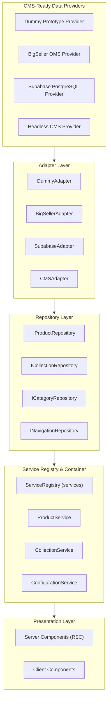

# AISCHMIRA.STORE — Enterprise Integration Architecture & API Strategy

**Version:** 1.1.0 (Sprint F2.6 — CMS-Ready Data Layer & Service Architecture)  
**Source of Truth:** `services/`, `domain/`, `core/config/`  

---

## 1. System Topology & Data Flow

The AISCHMIRA.STORE integration architecture operates on a decoupled multi-tier topology that connects **BigSeller Omnichannel OMS**, **Supabase Cloud Infrastructure**, **Headless CMS**, **Next.js App Router Service Layer**, and the **WhatsApp Concierge Commerce Channel**.

---

## 2. Layer Responsibilities & Provider Strategy

### 2.1 Provider Strategy (`services/providers/`)
Data access implementations are isolated behind the `IDataProvider` interface.
- **`DummyDataProvider`**: Prototype mock data provider.
- **`BigSellerDataProvider`**: BigSeller OMS provider specification.
- **`SupabaseDataProvider`**: Supabase PostgreSQL provider specification.
- **`CMSDataProvider`**: Headless CMS provider specification.
- **Switching**: Provider selection is configured in `services/providers/config.ts`. Switching active provider types requires zero changes to the UI layer.

### 2.2 Adapter Strategy (`services/adapters/`)
All raw transport payloads are converted to canonical domain models using `IDataAdapter<TInput, TOutput>`:
- `DummyAdapter`: Adapts mock records to domain models.
- `BigSellerAdapter`: Adapts OMS payloads to domain DTOs and Entities.
- `SupabaseAdapter`: Adapts PostgreSQL database rows to domain models.
- `CMSAdapter`: Adapts CMS GraphQL/REST JSON to domain models.

### 2.3 Cache Strategy (`services/cache/`)
Cache concerns are abstracted via `ICacheStrategy`:
- `NoopCacheStrategy`: Pass-through strategy.
- `MemoryCacheStrategy`: In-memory development cache.
- Future support: Next.js Cache (`unstable_cache`), Redis, Supabase edge cache.

### 2.4 Service Registry & Dependency Injection (`services/registry.ts`, `services/container.ts`)
- `ServiceRegistry`: Central container holding singletons for all application services (`product`, `collection`, `category`, `navigation`, `homepage`, `configuration`, `brand`, `footer`, `search`, `wishlist`, `shoppingBag`).
- `services`: Exported default service registry instance.
