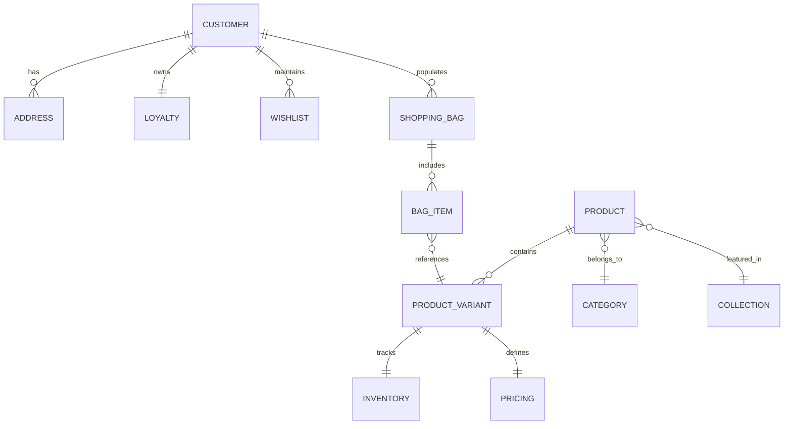

# AISCHMIRA.STORE — Enterprise Domain Data Model Specification

**Version:** 1.0.0  
**Source of Truth:** `types/`, `services/domain/*/types.ts`, `services/domain/*/schema.ts`  

---

## 1. Domain Overview & Entity Relationships

The AISCHMIRA.STORE data architecture is organized into 11 core domain entities designed for seamless integration with **BigSeller OMS**, **Supabase PostgreSQL**, and the **WhatsApp Concierge Checkout** channel.



---

## 2. Core Entity Definitions

### 2.1 Product Entity
Integrated with BigSeller OMS SKU hierarchy:

```typescript
export interface Variant {
  id: string;
  sku: string;                 // BigSeller SKU (e.g. AIS-SLK-SLV-M)
  color: string;
  size: string;
  stock: number;
  price: number;
  compareAtPrice?: number;
}

export interface Product {
  id: string;
  sku: string;                 // Parent SKU
  parentSku?: string;
  name: string;
  slug: string;
  price: number;
  compareAtPrice?: number;
  currency: "IDR";
  description: string;
  details: string[];
  fabricDetails: string;
  careInstructions: string;
  images: string[];
  category: string;            // Category Slug
  collection?: string;         // Collection Slug
  colors: string[];
  sizes: string[];
  inStock: boolean;
  isNewArrival?: boolean;
  isBestSeller?: boolean;
  isFeatured?: boolean;
  isActive: boolean;
  status: "ACTIVE" | "ARCHIVED" | "DRAFT";
  variants: Variant[];
  createdAt: string;
  updatedAt: string;
}
```

---

### 2.2 Collection Entity

```typescript
export interface Collection {
  id: string;
  title: string;
  slug: string;
  subtitle?: string;
  description: string;
  image: string;
  season?: string;
  year?: string;
  isFeatured?: boolean;
  productCount: number;
  productIds: string[];
}
```

---

### 2.3 Category Entity

```typescript
export interface Category {
  id: string;
  name: string;
  slug: string;
  description?: string;
  image?: string;
  parentCategoryId?: string;
}
```

---

### 2.4 Navigation Entity

```typescript
export interface NavItem {
  id: string;
  title: string;
  href: string;
  badge?: string;
  children?: NavItem[];
}
```

---

### 2.5 Shopping Bag & Wishlist Entities

```typescript
export interface CartItem {
  productId: string;
  variantId: string;
  sku: string;
  quantity: number;
  priceAtAddition: number;
}

export interface ShoppingBagState {
  items: CartItem[];
  subtotal: number;
  totalItems: number;
}

export interface WishlistState {
  productIds: string[];
}
```

---

### 2.6 Customer & Loyalty Entities

```typescript
export interface Address {
  id: string;
  recipientName: string;
  phone: string;
  streetAddress: string;
  city: string;
  province: string;
  postalCode: string;
  isDefault: boolean;
}

export interface Customer {
  id: string;
  email: string;
  firstName: string;
  lastName: string;
  phone: string;
  addresses: Address[];
  loyaltyTier: "SILVER" | "GOLD" | "PLATINUM" | "DIAMOND";
  createdAt: string;
}

export interface LoyaltyAccount {
  id: string;
  customerId: string;
  pointsBalance: number;
  lifetimePoints: number;
  currentTier: "SILVER" | "GOLD" | "PLATINUM" | "DIAMOND";
  nextTierPointsThreshold: number;
  referralCode: string;
  rewardsHistory: {
    id: string;
    description: string;
    points: number;
    date: string;
  }[];
}
```

---

### 2.7 Inventory & Pricing Entities (BigSeller Integration)

```typescript
export interface InventoryRecord {
  sku: string;
  warehouseLocation: string;
  availableStock: number;
  reservedStock: number;
  lastSyncedAt: string;
}

export interface PricingRecord {
  sku: string;
  regularPrice: number;
  promoPrice?: number;
  currency: "IDR";
  tierDiscounts?: {
    minQuantity: number;
    discountPercent: number;
  }[];
}
```
